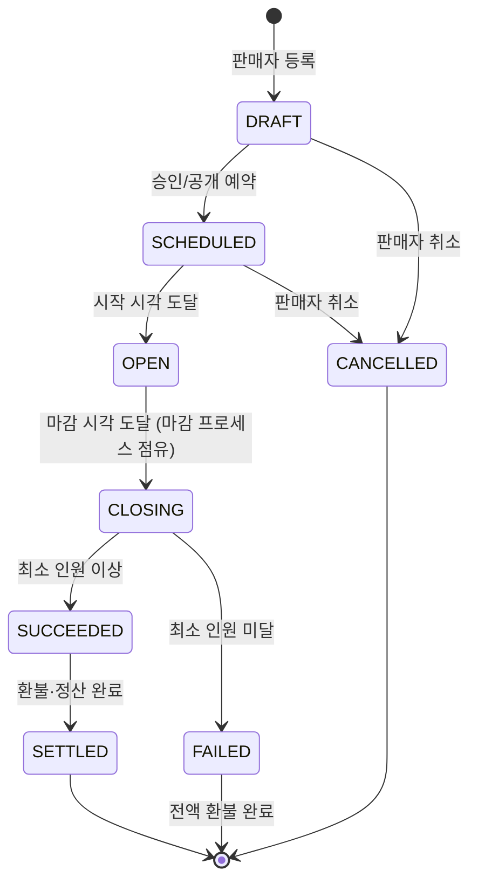
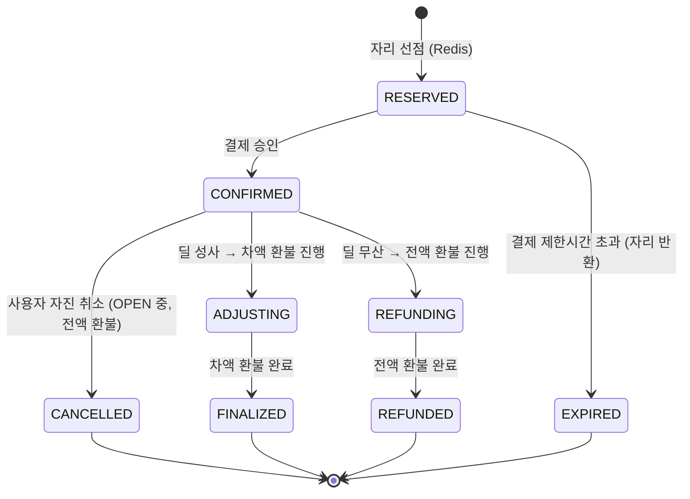
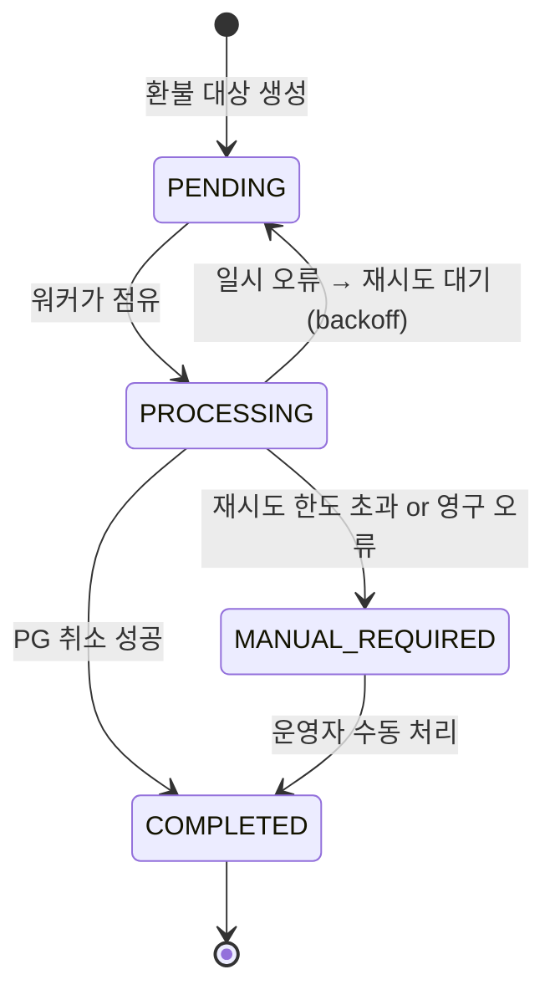
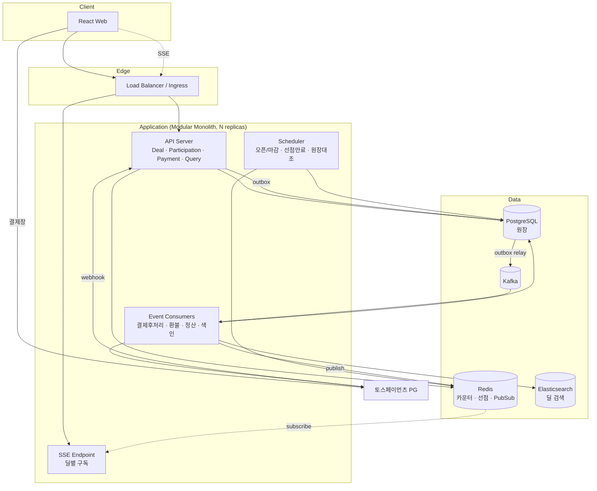
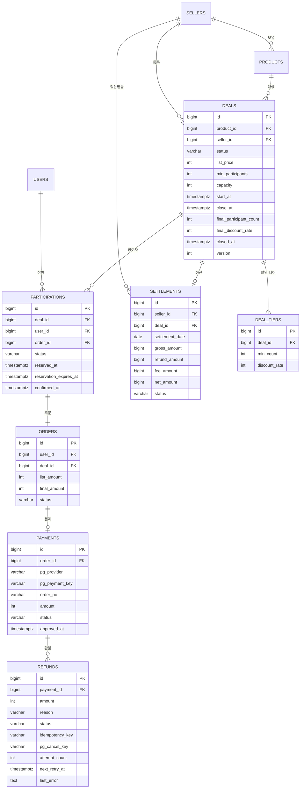
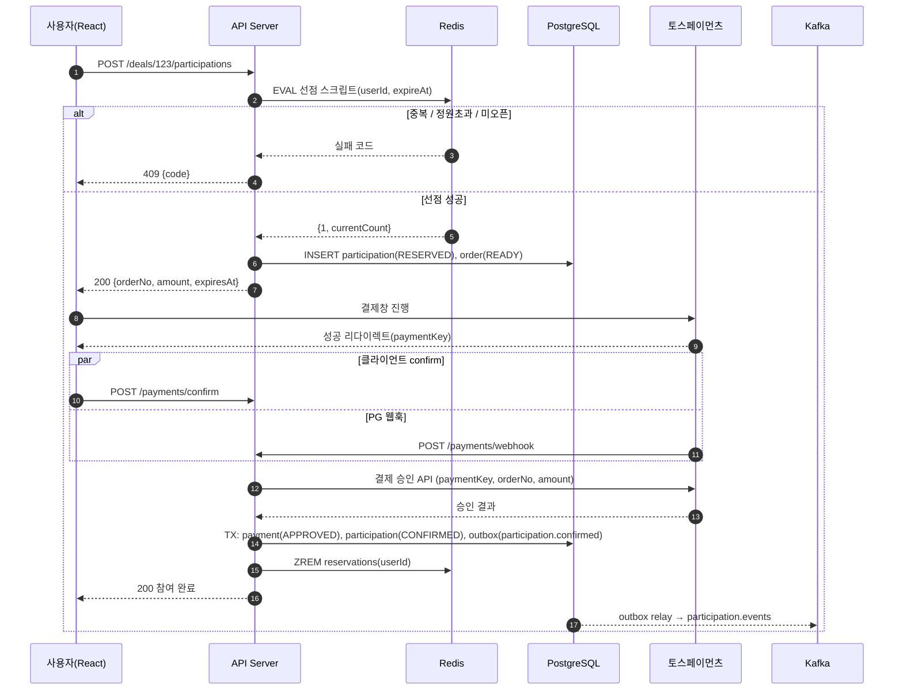
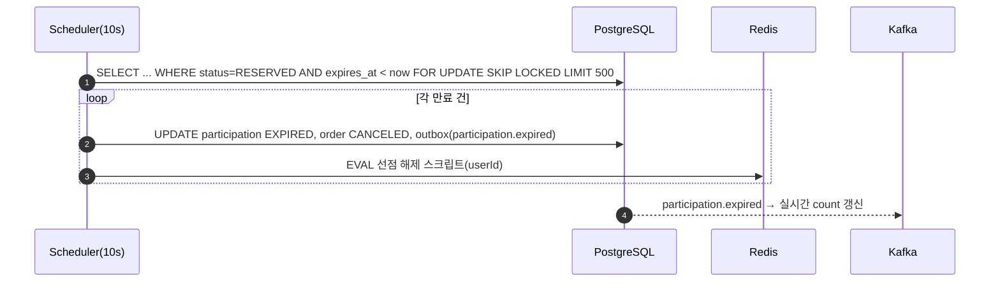
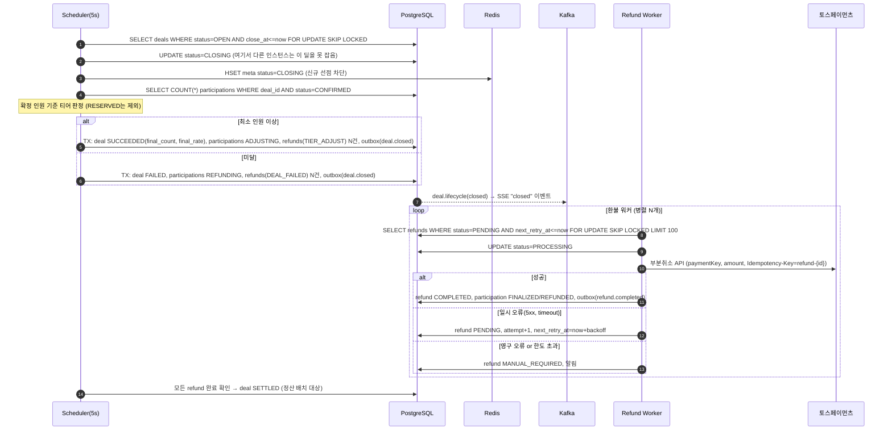
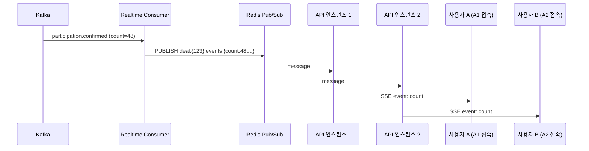

# 실시간 공동구매 플랫폼 — 도메인 정의 및 시스템 설계서

| 항목 | 내용 |
|---|---|
| 문서 버전 | v0.1 (초안) |
| 작성일 | 2026-09-15 |
| 목적 | 포트폴리오 프로젝트의 도메인 이해 공유 및 5단계 구현 설계 기준 확립 |
| 커버 목표 | 결제·정산 / 대규모 트래픽·동시성 / 실시간성 / 이벤트 기반 아키텍처 / 운영(k8s, CI/CD) |

---

## 목차

1. [프로젝트 개요](#1-프로젝트-개요)
2. [도메인 이해](#2-도메인-이해)
3. [기능 요구사항](#3-기능-요구사항)
4. [비기능 요구사항](#4-비기능-요구사항)
5. [시스템 아키텍처](#5-시스템-아키텍처)
6. [데이터 설계](#6-데이터-설계)
7. [Redis 설계](#7-redis-설계)
8. [이벤트(Kafka) 설계](#8-이벤트kafka-설계)
9. [API 설계](#9-api-설계)
10. [핵심 시나리오 시퀀스](#10-핵심-시나리오-시퀀스)
11. [단계별 구현 계획](#11-단계별-구현-계획)
12. [아키텍처 결정 기록(ADR)](#12-아키텍처-결정-기록adr)
13. [부하테스트 계획](#13-부하테스트-계획)
14. [리스크 및 대응](#14-리스크-및-대응)

---

## 1. 프로젝트 개요

### 1.1 한 줄 정의

**일정 시간 동안 참여자를 모아, 모인 인원에 따라 할인율이 올라가고, 마감 시점의 최종 인원으로 가격이 확정되는 공동구매 서비스.**

### 1.2 왜 이 주제인가

| 요구 역량 | 이 도메인에서 자연스럽게 발생하는 이유 |
|---|---|
| 결제·정산 | 참여 시점에 최종 가격을 알 수 없다 → 선결제 후 차액 환불, 무산 시 전액 환불, 판매자 정산과 원장 대조가 필수 |
| 대규모 트래픽·동시성 | 마감 직전 참여가 폭주한다 → 정원 초과 없이 원자적으로 인원을 세야 한다 |
| 실시간성 | "몇 명 남았다", "할인율이 올랐다"를 보고 있는 모든 사용자에게 즉시 전파해야 한다 |
| 이벤트 기반 | 참여 → 결제 → 마감 → 환불 → 정산이 서로 다른 시점·속도로 일어난다 → 비동기 처리와 재처리 가능성이 필요 |
| 스케줄링 | 수만 개의 딜이 각자 다른 시각에 마감된다 → 신뢰성 있는 마감 트리거와 장애 복구 |

### 1.3 범위

**포함**
- 판매자의 딜 등록, 구매자의 참여·결제, 자동 마감, 차액 환불, 판매자 정산, 실시간 현황 전파, 딜 검색

**제외 (명시적으로 하지 않음)**
- 배송·물류 추적, 리뷰, 쿠폰, 회원 등급, 소셜 로그인 다중 연동, 다중 통화

**단순화 가정**
- 1인당 1딜에 1개 수량만 참여 가능 (수량 로직 제거로 동시성 문제를 순수하게 유지)
- 결제 수단은 카드 1종 (토스페이먼츠 테스트 환경)
- 판매자 정산은 시뮬레이션 (실제 송금 없음, 정산 데이터만 생성)

---

## 2. 도메인 이해

### 2.1 핵심 용어 (Ubiquitous Language)

| 용어 | 영문 | 정의 |
|---|---|---|
| 딜 | Deal | 하나의 상품에 대해 기간·인원 조건·할인 티어를 묶은 공동구매 단위. 시스템의 중심 개념 |
| 판매자 | Seller | 딜을 등록하고, 성사 시 정산을 받는 주체 |
| 참여자 | Participant | 딜에 참여(결제)한 구매자 |
| 참여 | Participation | 특정 사용자가 특정 딜에 자리를 차지한 사실. 딜당 사용자당 1건 |
| 정원 | Capacity | 딜에 참여할 수 있는 최대 인원 |
| 최소 인원 | Min Participants | 이 인원을 넘어야 딜이 성사됨 |
| 할인 티어 | Discount Tier | "N명 이상이면 X% 할인" 규칙. 딜당 여러 개 |
| 정가 | List Price | 할인 전 상품 가격. 선결제 기준 금액 |
| 예상 할인율 | Projected Rate | 현재 인원 기준으로 적용될 것으로 보이는 할인율. **확정 아님** |
| 확정 할인율 | Final Rate | 마감 시점 최종 인원으로 결정된 할인율. **모든 참여자에게 동일 적용** |
| 마감 | Close | 마감 시각 도달로 참여를 종료하고 결과(성사/무산)를 판정하는 행위 |
| 성사 | Succeeded | 마감 시 최소 인원 이상 → 확정 할인율로 거래 확정 |
| 무산 | Failed | 마감 시 최소 인원 미달 → 전원 전액 환불 |
| 차액 환불 | Tier Refund | 성사 시 정가 결제액과 확정 금액의 차이를 돌려주는 부분 취소 |
| 정산 | Settlement | 성사된 딜의 매출·환불·수수료를 집계해 판매자 지급액을 산출하는 것 |
| 원장 대조 | Reconciliation | PG사 거래 내역과 내부 결제/환불 기록을 대조해 불일치를 찾는 작업 |

### 2.2 딜의 구조 예시

```
딜: "무선 이어폰 공동구매"
├─ 정가: 100,000원
├─ 기간: 2026-09-20 10:00 ~ 2026-09-22 22:00
├─ 최소 인원: 10명   (미달 시 무산)
├─ 정원: 200명       (초과 참여 불가)
└─ 할인 티어
   ├─  1 ~  9명 : 0%   (성사 불가 구간)
   ├─ 10 ~ 29명 : 10%  → 90,000원
   ├─ 30 ~ 49명 : 20%  → 80,000원
   └─ 50명 이상 : 30%  → 70,000원
```

**마감 시 47명 참여** → 확정 할인율 20% → 전원 80,000원 → 각자 20,000원 차액 환불
**마감 시 7명 참여** → 최소 인원 미달 → 무산 → 전원 100,000원 전액 환불

### 2.3 도메인 핵심 규칙 (Invariants)

이 규칙들은 어떤 상황(동시 요청, 장애, 재처리)에서도 깨져서는 안 되며, 테스트로 보호한다.

| # | 규칙 | 위반 시 결과 |
|---|---|---|
| R1 | 확정 참여자 수는 정원을 초과할 수 없다 | 판매자에게 재고 이상의 주문 발생 |
| R2 | 한 사용자는 한 딜에 최대 1건만 참여할 수 있다 | 인원 조작, 할인율 부정 달성 |
| R3 | 할인율은 마감 시점 최종 인원으로만 확정되며, 참여 순서와 무관하게 전원 동일하다 | 49번째와 50번째 참여자의 가격이 달라지는 불공정 |
| R4 | 참여자가 최종적으로 부담하는 금액은 정확히 `정가 × (1 − 확정 할인율)` 이다 | 과다 청구 또는 환불 누락 |
| R5 | 무산된 딜의 모든 결제는 전액 환불된다 | 상품 없이 돈만 받은 상태 |
| R6 | 동일한 환불 요청은 몇 번 실행되어도 한 번만 PG에 반영된다 (멱등성) | 이중 환불 |
| R7 | 내부 결제·환불 합계는 PG사 기록과 일치해야 한다 | 정산 금액 오류 |
| R8 | 마감은 정확히 한 번만 실행된다 | 환불·정산 중복 |

> **R3에 대한 설계 관점** — 참여 시점의 할인율을 "예상"으로만 취급하고 확정을 마감으로 미루면, 동시성 문제가 "인원 카운팅"으로만 좁혀진다. 티어 경계에서의 경쟁 조건이 도메인 규칙으로 해소되는 것이다. 이 결정은 [ADR-02](#adr-02-할인율-확정-시점)에서 다룬다.

### 2.4 딜 생명주기 (상태 머신)



| 상태 | 참여 가능 | 설명 |
|---|---|---|
| DRAFT | ✗ | 등록만 된 상태 |
| SCHEDULED | ✗ | 시작 대기. 목록에는 "오픈 예정"으로 노출 가능 |
| OPEN | ✓ | 참여 접수 중. Redis 카운터 활성 |
| CLOSING | ✗ | 마감 처리 중. **중복 마감 방지용 중간 상태** (R8) |
| SUCCEEDED | ✗ | 성사. 확정 할인율 기록, 차액 환불 진행 |
| FAILED | ✗ | 무산. 전액 환불 진행 |
| SETTLED | ✗ | 환불 완료 + 정산 생성 완료 |
| CANCELLED | ✗ | 오픈 전 판매자 취소 |

### 2.5 참여 생명주기



**RESERVED 상태가 존재하는 이유** — 참여 버튼을 누른 시점과 결제가 완료되는 시점 사이에 수 초~수 분의 간격이 있다. 이 사이에 자리를 확보해 주지 않으면 결제 완료 후 "정원 초과"를 통보해야 하는 최악의 UX가 된다. 반대로 영구히 확보하면 결제하지 않은 사람이 자리를 점유한다. 따라서 **TTL이 있는 선점**이 필요하다(기본 10분).

### 2.6 환불 생명주기



### 2.7 참여자 여정 (사용자 관점)

```
1. 딜 목록에서 "마감 임박" 딜 발견 (현재 28명 / 30명 넘으면 20%)
2. 딜 상세 진입 → 실시간 게이지가 채워지는 것을 봄
3. [참여하기] 클릭 → 자리 선점, 결제창 오픈 (정가 100,000원 결제 안내 + "마감 후 차액 자동 환불")
4. 결제 완료 → "참여 완료. 현재 예상 할인율 10%, 마감 시 확정"
5. (대기) 알림: "30명 달성! 예상 할인율 20%로 올랐어요"
6. 마감 → 알림: "딜 성사. 최종 47명, 20% 할인 확정. 20,000원이 환불됩니다"
7. 마이페이지에서 환불 진행 상태 확인
```

---

## 3. 기능 요구사항

### 3.1 액터

| 액터 | 설명 |
|---|---|
| 구매자 | 딜 탐색, 참여, 결제, 취소, 내역 조회 |
| 판매자 | 딜 등록·수정·취소, 정산 조회 |
| 운영자 | 환불 실패 건 수동 처리, 원장 대조 실행·결과 확인 |
| 시스템(스케줄러/워커) | 딜 오픈·마감, 선점 만료, 환불 실행, 정산 배치, 원장 대조 |

### 3.2 유스케이스 목록

| ID | 액터 | 유스케이스 | 단계 |
|---|---|---|---|
| UC-01 | 판매자 | 딜을 등록한다 (상품, 기간, 최소인원, 정원, 티어) | 1 |
| UC-02 | 구매자 | 딜 목록을 조회한다 (마감임박순, 인기순, 검색) | 1 / 5(ES) |
| UC-03 | 구매자 | 딜 상세를 조회한다 (현재 인원, 예상 할인율, 남은 시간) | 1 |
| UC-04 | 구매자 | 딜에 참여한다 (자리 선점 → 결제) | 1 / 2(동시성) |
| UC-05 | 구매자 | 참여를 취소한다 (OPEN 중, 전액 환불) | 3 |
| UC-06 | 시스템 | 결제 제한시간이 지난 선점을 해제한다 | 2 |
| UC-07 | 시스템 | 마감 시각에 딜을 마감하고 성사/무산을 판정한다 | 1(단순) / 3(신뢰성) |
| UC-08 | 시스템 | 성사 딜의 참여자 전원에게 차액을 환불한다 | 3 |
| UC-09 | 시스템 | 무산 딜의 참여자 전원에게 전액 환불한다 | 3 |
| UC-10 | 구매자 | 딜 현황 변화를 실시간으로 받는다 | 4 |
| UC-11 | 구매자 | 내 참여·환불 내역을 조회한다 | 1 |
| UC-12 | 시스템 | 성사 딜을 판매자별로 정산한다 (일 배치) | 5 |
| UC-13 | 시스템/운영자 | PG 거래내역과 내부 기록을 대조한다 | 5 |
| UC-14 | 운영자 | 환불 실패 건을 조회하고 수동 처리한다 | 3 |
| UC-15 | 판매자 | 정산 내역을 조회한다 | 5 |

### 3.3 핵심 유스케이스 상세: UC-04 딜 참여

**사전 조건**: 사용자 로그인, 딜 상태 OPEN

**기본 흐름**
1. 사용자가 참여를 요청한다
2. 시스템은 원자적으로 다음을 검사·수행한다: (a) 중복 참여 여부 (b) 정원 여유 (c) 자리 선점 + 카운트 증가
3. 시스템은 주문(정가 기준)을 생성하고 결제 파라미터를 반환한다
4. 사용자가 PG 결제창에서 결제한다
5. PG가 결제 성공을 통지한다 (클라이언트 confirm + 서버 webhook 이중)
6. 시스템은 결제를 승인 처리하고 참여를 CONFIRMED로 전이한다
7. 시스템은 `participation.confirmed` 이벤트를 발행한다

**대안 흐름**
- 2a. 이미 참여한 사용자 → 409 DUPLICATE_PARTICIPATION
- 2b. 정원 초과 → 409 DEAL_FULL
- 2c. 딜이 OPEN이 아님 → 409 DEAL_NOT_OPEN
- 4a. 사용자가 결제를 중단 → 선점은 TTL 만료 후 자동 해제 (UC-06)
- 5a. 결제 승인 API 호출 실패 → 재시도, 최종 실패 시 선점 해제 + 사용자 안내
- 5b. 승인 직전 딜이 마감됨 → 승인 취소(전액), 참여 EXPIRED 처리 ([ADR-07](#adr-07-마감-시점의-선점-처리))

---

## 4. 비기능 요구사항

### 4.1 성능 목표

| 지표 | 목표 | 측정 방법 |
|---|---|---|
| 참여 요청 처리량 (피크) | 10,000 TPS, 5분 유지 | k6, 단일 인기 딜 집중 시나리오 |
| 참여 API 응답시간 | p99 < 200ms (Redis 선점까지) | k6 |
| 딜 상세 조회 | p99 < 100ms | k6 |
| 실시간 동시 접속 | 딜당 10,000 SSE 연결 | 커스텀 부하 스크립트 |
| 실시간 전파 지연 | 참여 → 다른 사용자 화면 반영 < 1초 | 타임스탬프 비교 |
| 마감 정확도 | 마감 시각 대비 지연 < 5초 | 스케줄러 로그 |
| 환불 완료 | 마감 후 10분 내 95% 완료 (PG 정상 시) | refunds 테이블 통계 |

### 4.2 정합성 목표

| 항목 | 목표 |
|---|---|
| 정원 초과 (R1) | 0건 — 부하테스트 후 `COUNT(confirmed) <= capacity` 검증 |
| 중복 참여 (R2) | 0건 — DB Unique 제약 + Redis Set 이중 방어 |
| 이중 환불 (R6) | 0건 — 멱등키 + PG 응답 검증 |
| 원장 불일치 (R7) | 0건, 발생 시 대조 결과에 반드시 노출 |

### 4.3 가용성·운영

- 애플리케이션 인스턴스 N대 수평 확장 가능 (무상태)
- 인스턴스 1대 강제 종료 시 진행 중 마감·환불이 유실되지 않음 (복구 테스트로 검증)
- Kafka 컨슈머는 멱등 — 동일 이벤트 재수신 시 부작용 없음
- 부하에 따른 자동 확장 (k8s HPA, CPU 또는 커스텀 메트릭 기준)

---

## 5. 시스템 아키텍처

### 5.1 기술 스택

| 영역 | 선택 | 선택 이유 |
|---|---|---|
| 언어 / 프레임워크 | Kotlin, Spring Boot 3.x | 공고 요구(Java/Kotlin, Spring). 코루틴은 사용하지 않고 스레드 모델 유지(단순성) |
| 원장 DB | PostgreSQL 16 | 주문·결제·환불·정산은 강한 정합성 필요. `SKIP LOCKED`, 파티셔닝 지원 |
| 캐시 / 원자 연산 | Redis 7 | 참여 카운팅·선점·중복 방지의 Lua 원자 연산, Pub/Sub |
| 이벤트 브로커 | Apache Kafka | 참여·결제·마감·환불 이벤트의 내구성·재처리·컨슈머 분리 |
| 검색 | Elasticsearch 8 | 딜 검색, 정렬(마감임박·인기), 한글 분석(Nori) |
| 클라이언트 | React 18 + TypeScript (Vite) | 딜 목록/상세, SSE 실시간 게이지, 마이페이지 |
| PG | 토스페이먼츠 (테스트) | 문서·샌드박스 품질, 부분 취소 API 지원 |
| 인프라 | Docker Compose(로컬) → k3s + HPA → AWS EC2 | 비용 대비 k8s 경험 확보 |
| CI/CD | GitHub Actions | 테스트 → 이미지 빌드 → 배포 |
| 부하테스트 | k6 | 시나리오 스크립트, 임계값 검증 |
| 관측성 | Micrometer + Prometheus + Grafana, Loki(선택) | 부하테스트 중 JVM/DB/Redis 지표 시각화 |
| 테스트 | JUnit5, Kotest(선택), Testcontainers | 실제 PostgreSQL/Redis/Kafka 컨테이너로 통합 테스트 |

### 5.2 컴포넌트 구성



### 5.3 모듈 구조 (Modular Monolith)

처음부터 MSA로 쪼개지 않는다. 경계(Bounded Context)는 명확히 두되 하나의 배포 단위로 시작하고, 부하 특성이 다른 모듈(예: 실시간, 워커)만 5단계에서 분리 배포한다. ([ADR-01](#adr-01-배포-단위-모듈러-모놀리스-vs-msa))

```
groupbuy/
├── apps/
│   ├── api/            # HTTP API + SSE. 얇은 컨트롤러, 모듈 호출
│   ├── worker/         # Kafka 컨슈머 + 스케줄러. api와 동일 모듈 의존
│   └── web/            # React
├── modules/
│   ├── deal/           # 딜 등록·상태전이·마감 판정 (도메인 핵심)
│   ├── participation/  # 선점·참여·취소, Redis 원자 연산
│   ├── payment/        # PG 연동, 결제 승인, 환불 실행, 멱등성
│   ├── settlement/     # 정산 집계, 원장 대조
│   ├── realtime/       # 이벤트 → Redis Pub/Sub → SSE
│   ├── search/         # ES 색인·검색
│   └── common/         # Outbox, 이벤트 스키마, 에러, 시간(Clock) 추상화
└── infra/
    ├── docker-compose.yml
    ├── k8s/
    └── k6/
```

**모듈 간 의존 규칙**
- `deal` ← `participation` ← `payment` 방향의 의존만 허용. 역방향은 이벤트로만 통신
- `settlement`, `realtime`, `search`는 이벤트 컨슈머로만 동작하며 다른 모듈을 직접 호출하지 않음
- 모듈 경계는 ArchUnit 테스트로 강제

### 5.4 데이터 흐름 요약

| 흐름 | 경로 | 일관성 |
|---|---|---|
| 참여 선점 | API → Redis Lua → PG(주문 insert) | Redis가 선점의 진실 원천, PG는 기록 |
| 결제 확정 | PG webhook/confirm → PG(payment, participation 갱신 + outbox) → Kafka | 트랜잭션 내 outbox로 이벤트 유실 방지 |
| 실시간 전파 | Kafka `participation.confirmed` → Worker → Redis Pub/Sub → SSE | 최종 일관성, < 1초 |
| 마감 | Scheduler → PG(CLOSING 점유) → Redis 카운트 스냅샷 → PG(판정) → outbox → Kafka | 정확히 한 번 (SKIP LOCKED + 상태 전이) |
| 환불 | Kafka `deal.closed` → Worker → refunds 생성 → 환불 워커 → 토스 취소 API | 멱등, 재시도, 최종 일관성 |
| 정산 | 일 배치 → PG 집계 → settlements | 배치, 재실행 가능(멱등) |

---

## 6. 데이터 설계

### 6.1 ERD



### 6.2 테이블 정의 (핵심)

**deals**

| 컬럼 | 타입 | 설명 |
|---|---|---|
| id | bigint PK | |
| product_id, seller_id | bigint FK | |
| status | varchar(20) | DRAFT / SCHEDULED / OPEN / CLOSING / SUCCEEDED / FAILED / SETTLED / CANCELLED |
| list_price | int | 정가 (딜 생성 시 상품 가격 스냅샷) |
| min_participants | int | 성사 최소 인원 |
| capacity | int | 정원 |
| start_at, close_at | timestamptz | 오픈·마감 시각 |
| final_participant_count | int null | 마감 시 확정 인원 |
| final_discount_rate | int null | 마감 시 확정 할인율(%) |
| closed_at | timestamptz null | 실제 마감 처리 시각 |
| version | int | 낙관적 락 |

인덱스: `(status, close_at)` — 마감 대상 폴링용, `(status, start_at)` — 오픈 대상 폴링용

**participations**

| 컬럼 | 타입 | 설명 |
|---|---|---|
| status | varchar(20) | RESERVED / CONFIRMED / EXPIRED / CANCELLED / ADJUSTING / FINALIZED / REFUNDING / REFUNDED |
| reservation_expires_at | timestamptz | RESERVED 상태의 만료 시각 |

제약: `UNIQUE (deal_id, user_id)` — R2의 최종 방어선. Redis가 초기화되거나 우회되어도 DB가 막는다.
인덱스: `(status, reservation_expires_at)` — 만료 선점 스캔용

**payments**

| 컬럼 | 설명 |
|---|---|
| order_no | 우리 시스템의 주문번호. PG에 전달하는 식별자. `UNIQUE` |
| pg_payment_key | PG가 발급한 결제 키. `UNIQUE`. 취소 시 사용 |
| status | READY / APPROVED / PARTIALLY_CANCELED / CANCELED / FAILED |

**refunds**

| 컬럼 | 설명 |
|---|---|
| reason | TIER_ADJUST(차액) / DEAL_FAILED(무산 전액) / USER_CANCEL(자진 취소) / DEAL_CLOSED_DURING_PAYMENT(마감 직후 승인분) |
| idempotency_key | `refund-{refund_id}` 형태. PG 호출 시 Idempotency-Key 헤더로 전달. `UNIQUE` |
| status | PENDING / PROCESSING / COMPLETED / MANUAL_REQUIRED |
| attempt_count, next_retry_at | 지수 백오프 재시도 제어 |

인덱스: `(status, next_retry_at)` — 환불 워커 폴링용

**outbox_events**

| 컬럼 | 설명 |
|---|---|
| id | bigint PK (순서 보장용 단조 증가) |
| aggregate_type, aggregate_id | 예: DEAL / 123 → Kafka 파티션 키로 사용 |
| event_type | 예: `participation.confirmed` |
| payload | jsonb |
| created_at, published_at | published_at null이면 미발행 |

**reconciliation_results**

| 컬럼 | 설명 |
|---|---|
| target_date | 대조 대상 일자 |
| kind | PAYMENT / REFUND |
| pg_reference | PG 측 거래 식별자 |
| internal_reference | 내부 식별자 (없으면 null) |
| mismatch_type | MISSING_INTERNAL / MISSING_PG / AMOUNT_MISMATCH / STATUS_MISMATCH |
| resolved | 운영자 처리 여부 |

### 6.3 금액 계산 규칙

```
final_amount        = list_price × (100 − final_discount_rate) / 100   (원 단위 내림)
tier_refund_amount  = list_amount − final_amount
fee_amount          = Σ final_amount × platform_fee_rate                  (원 단위 내림)
net_amount          = Σ final_amount − fee_amount
```

- 모든 금액은 정수(원). 소수점 연산 없음
- 내림으로 인한 1원 차이는 정산 단계에서 `rounding_adjustment`로 별도 기록 (원장 대조 시 오차 원인을 추적 가능하게)

---

## 7. Redis 설계

### 7.1 키 설계

| 키 | 타입 | 값 | TTL | 용도 |
|---|---|---|---|---|
| `deal:{dealId}:count` | String(int) | 선점+확정 인원 합 | 마감 + 1일 | 정원 검사, 예상 할인율 계산 |
| `deal:{dealId}:members` | Set | userId 집합 | 마감 + 1일 | 중복 참여 방지 (R2 1차 방어) |
| `deal:{dealId}:reservations` | ZSet | member=userId, score=만료 epoch | 마감 + 1일 | 선점 만료 스캔 |
| `deal:{dealId}:meta` | Hash | status, capacity, close_at | 마감 + 1일 | Lua 스크립트가 DB 없이 검사 |
| `deal:{dealId}:events` | Pub/Sub 채널 | JSON 이벤트 | — | SSE 팬아웃 |
| `deal:close:queue` | ZSet | member=dealId, score=close_at | — | 마감 대상 빠른 조회 (DB 폴링 보조) |

- 딜별 키는 `{dealId}` 해시태그로 묶어 Redis Cluster 전환 시 동일 슬롯에 배치되도록 한다: `deal:{123}:count`

### 7.2 참여 선점 Lua 스크립트

```lua
-- KEYS[1] = deal:{id}:count
-- KEYS[2] = deal:{id}:members
-- KEYS[3] = deal:{id}:reservations
-- KEYS[4] = deal:{id}:meta
-- ARGV[1] = userId
-- ARGV[2] = reservation expire epoch
-- ARGV[3] = now epoch

local status = redis.call('HGET', KEYS[4], 'status')
if status ~= 'OPEN' then return {-3, 0} end                 -- DEAL_NOT_OPEN

if redis.call('SISMEMBER', KEYS[2], ARGV[1]) == 1 then
  return {-1, 0}                                             -- DUPLICATE
end

local capacity = tonumber(redis.call('HGET', KEYS[4], 'capacity'))
local count = tonumber(redis.call('GET', KEYS[1]) or '0')
if count >= capacity then return {-2, count} end            -- FULL

redis.call('SADD', KEYS[2], ARGV[1])
redis.call('ZADD', KEYS[3], ARGV[2], ARGV[1])
local newCount = redis.call('INCR', KEYS[1])
return {1, newCount}                                        -- OK, 현재 인원
```

**왜 Lua인가** — 검사(중복·정원)와 변경(SADD·INCR)이 서로 다른 명령이면 그 사이에 다른 요청이 끼어들 수 있다. Lua 스크립트는 Redis에서 원자적으로 실행되어 이 간격을 없앤다. 2단계에서 `SETNX` 분산락, `WATCH/MULTI`, Lua 세 가지를 구현해 처리량을 비교한다.

### 7.3 선점 해제 스크립트 (만료·결제 실패·자진 취소)

```lua
-- KEYS: count, members, reservations / ARGV: userId
if redis.call('SREM', KEYS[2], ARGV[1]) == 1 then
  redis.call('ZREM', KEYS[3], ARGV[1])
  redis.call('DECR', KEYS[1])
  return 1
end
return 0
```

결제 확정 시에는 `reservations` ZSet에서만 제거한다(`members`·`count`는 유지).

### 7.4 Redis ↔ DB 정합 전략

| 상황 | 처리 |
|---|---|
| Redis 장애로 카운터 유실 | 딜을 일시 CLOSED 표기 → DB `participations`(RESERVED+CONFIRMED)로 재구성 스크립트 실행 → 재개 |
| Redis 카운트 > DB 확정 수 | 정상 (선점 중 포함). 마감 시점 스냅샷은 **DB CONFIRMED 기준**으로 확정 ([ADR-07](#adr-07-마감-시점의-선점-처리)) |
| DB insert 실패 (선점 성공 후) | 즉시 선점 해제 스크립트 실행. 실패하면 만료 스캐너가 회수 |

---

## 8. 이벤트(Kafka) 설계

### 8.1 토픽

| 토픽 | 파티션 키 | 프로듀서 | 컨슈머 | 설명 |
|---|---|---|---|---|
| `deal.lifecycle` | dealId | deal 모듈 | realtime, search, settlement | opened / closed(succeeded, failed) / settled |
| `participation.events` | dealId | participation, payment 모듈 | realtime, search(인기도) | reserved / confirmed / cancelled / expired |
| `payment.events` | orderId | payment 모듈 | participation | approved / failed |
| `refund.commands` | paymentId | deal 마감 컨슈머 | payment(환불 워커) | 환불 실행 요청 |
| `refund.events` | paymentId | payment 모듈 | participation, settlement, realtime | completed / manual_required |
| `*.dlq` | 원본 키 | 컨슈머 프레임워크 | 운영자 | 처리 실패 이벤트 격리 |

파티션 키를 dealId로 잡는 이유: 같은 딜의 이벤트가 순서대로 처리되어야 실시간 카운트가 역행하지 않는다.

### 8.2 이벤트 스키마 (공통 envelope)

```json
{
  "eventId": "uuid",
  "eventType": "participation.confirmed",
  "aggregateType": "DEAL",
  "aggregateId": "123",
  "occurredAt": "2026-09-20T10:15:30Z",
  "version": 1,
  "payload": {
    "dealId": 123,
    "userId": 456,
    "participationId": 789,
    "currentCount": 47,
    "projectedDiscountRate": 20
  }
}
```

### 8.3 발행 신뢰성 — Transactional Outbox

DB 트랜잭션 커밋과 Kafka 발행은 원자적으로 묶을 수 없다. "DB는 커밋됐는데 Kafka 발행 전에 죽으면" 실시간 카운트가 영원히 안 맞는다. 따라서:

1. 비즈니스 변경과 `outbox_events` insert를 **같은 트랜잭션**에서 수행
2. 별도 릴레이(폴링 또는 Debezium CDC)가 outbox를 읽어 Kafka로 발행 후 `published_at` 기록
3. 릴레이는 at-least-once → 컨슈머는 `eventId`로 멱등 처리

### 8.4 컨슈머 멱등성

모든 컨슈머는 `processed_events(consumer_group, event_id)` 테이블에 처리 기록을 남기고, 이미 있으면 skip. 환불 워커는 이에 더해 `refunds.idempotency_key`로 PG 레벨 멱등성까지 이중 보장.

---

## 9. API 설계

### 9.1 원칙

- REST, JSON, 인증은 JWT Bearer
- 상태 변경은 명시적 동사 리소스 대신 하위 리소스 POST (`/deals/{id}/participations`)
- 에러 응답 표준: `{ "code": "DEAL_FULL", "message": "...", "traceId": "..." }`
- 쓰기 API는 클라이언트 `Idempotency-Key` 헤더 지원 (재시도 안전)

### 9.2 엔드포인트

**딜 (구매자)**

| Method | Path | 설명 | 단계 |
|---|---|---|---|
| GET | `/api/deals` | 목록. `?sort=closing_soon\|popular&q=키워드&status=OPEN` | 1 → 5(ES) |
| GET | `/api/deals/{id}` | 상세. 현재 인원, 예상 할인율, 티어, 남은 시간 | 1 |
| GET | `/api/deals/{id}/stream` | SSE. 인원·티어·상태 변경 푸시 | 4 |

**참여·결제**

| Method | Path | 설명 |
|---|---|---|
| POST | `/api/deals/{id}/participations` | 자리 선점 + 주문 생성. 응답: orderNo, amount, 결제 파라미터, 선점 만료 시각 |
| POST | `/api/payments/confirm` | PG 성공 리다이렉트 후 클라이언트 호출. `{paymentKey, orderNo, amount}` → 서버가 PG 승인 API 호출 |
| POST | `/api/payments/webhook` | PG 웹훅. 서명 검증 후 confirm과 동일 처리 (둘 중 먼저 온 쪽이 처리, 나머지는 멱등 skip) |
| DELETE | `/api/participations/{id}` | 자진 취소 (딜 OPEN 중만). 전액 환불 생성 |
| GET | `/api/me/participations` | 내 참여 목록. 상태·확정 금액·환불 진행 |

**판매자**

| Method | Path | 설명 |
|---|---|---|
| POST | `/api/seller/deals` | 딜 등록 (티어 포함, 유효성: 티어 min_count 오름차순·할인율 오름차순, min_participants ≤ capacity) |
| PATCH | `/api/seller/deals/{id}` | DRAFT/SCHEDULED만 수정 가능 |
| POST | `/api/seller/deals/{id}/cancel` | 오픈 전 취소 |
| GET | `/api/seller/settlements` | 정산 내역 |

**운영**

| Method | Path | 설명 |
|---|---|---|
| GET | `/api/admin/refunds?status=MANUAL_REQUIRED` | 실패 환불 목록 |
| POST | `/api/admin/refunds/{id}/retry` | 수동 재시도 |
| POST | `/api/admin/refunds/{id}/resolve` | 외부 처리 완료 표시 |
| POST | `/api/admin/reconciliation/run?date=` | 원장 대조 실행 |
| GET | `/api/admin/reconciliation/results?date=` | 불일치 목록 |

### 9.3 딜 상세 응답 예시

```json
{
  "id": 123,
  "title": "무선 이어폰 공동구매",
  "status": "OPEN",
  "listPrice": 100000,
  "capacity": 200,
  "minParticipants": 10,
  "currentCount": 47,
  "projectedDiscountRate": 20,
  "projectedPrice": 80000,
  "nextTier": { "minCount": 50, "discountRate": 30, "remaining": 3 },
  "tiers": [
    { "minCount": 10, "discountRate": 10 },
    { "minCount": 30, "discountRate": 20 },
    { "minCount": 50, "discountRate": 30 }
  ],
  "closeAt": "2026-09-22T22:00:00+09:00",
  "myParticipation": { "id": 789, "status": "CONFIRMED" }
}
```

`currentCount`는 Redis에서 읽는다. DB를 조회하지 않아야 상세 페이지가 트래픽을 견딘다.

### 9.4 SSE 이벤트

```
event: count
data: {"currentCount":48,"projectedDiscountRate":20,"nextTierRemaining":2}

event: tier
data: {"currentCount":50,"projectedDiscountRate":30,"message":"30% 할인 구간 진입"}

event: closed
data: {"result":"SUCCEEDED","finalCount":53,"finalDiscountRate":30,"finalPrice":70000}
```

서버는 딜별로 **최대 2회/초**로 count 이벤트를 병합(coalesce)해서 보낸다. 초당 수백 건의 참여가 있어도 클라이언트로는 마지막 값만 나간다.

---

## 10. 핵심 시나리오 시퀀스

### 10.1 딜 참여 및 결제



### 10.2 선점 만료



### 10.3 마감 → 판정 → 환불



**환불 재시도 정책**: 1분 → 5분 → 30분 → 2시간 → 12시간, 5회 초과 시 MANUAL_REQUIRED. 타임아웃 후 실제 성공했을 수 있으므로 재시도 전 PG 조회 API로 상태를 먼저 확인한다.

### 10.4 실시간 전파



인스턴스가 여러 대여도 각 인스턴스는 자기에게 붙은 SSE 연결만 알면 된다. Redis Pub/Sub가 "누가 어디 붙었는지"를 몰라도 되게 해준다.

### 10.5 정산 배치 및 원장 대조

```
매일 02:00 정산 배치
  1. 전일 SETTLED 전이된 딜 조회
  2. 딜별: gross = Σ final_amount, refund = Σ 환불액, fee = gross × rate
  3. settlements upsert (deal_id 기준 멱등 → 재실행 안전)
  4. deal.lifecycle(settled) 발행

매일 03:00 원장 대조
  1. PG 거래내역 조회 API로 전일 승인·취소 목록 수집
  2. 내부 payments/refunds와 (pg_payment_key, amount, status) 기준 diff
  3. 불일치 → reconciliation_results insert + 운영자 알림
  4. 불일치 0건이면 "정합성 확인" 마킹
```

---

## 11. 단계별 구현 계획

각 단계는 **동작하는 시스템 + 측정 결과 + ADR** 세 가지를 산출물로 남긴다. 다음 단계는 이전 단계의 측정에서 드러난 한계를 동기로 시작한다.

### Phase 1 — MVP: 동작하는 공동구매 (2~3주)

**목표**: 도메인 규칙이 코드로 표현된 상태. 동시성·비동기 없음. 일부러 단순하게.

| 구현 | 상세 |
|---|---|
| 도메인 | Deal, Tier, Participation, Order, Payment 엔티티, 상태 전이, 금액 계산 |
| 참여 | DB 트랜잭션 + `SELECT ... FOR UPDATE`로 카운트. Redis 없음 |
| 결제 | 토스 테스트 결제 승인, 웹훅 수신 |
| 마감 | 단순 스케줄러(1분 폴링), 단일 인스턴스 가정 |
| 환불 | 마감 트랜잭션 안에서 동기 호출 (실패하면 전체 실패 — 의도된 한계) |
| 조회 | 딜 목록·상세를 DB에서 직접 |
| 클라이언트 | React 딜 목록/상세/참여/마이페이지, 실시간 없음(수동 새로고침) |
| 테스트 | 도메인 규칙(R1~R5) 단위 테스트, Testcontainers 통합 테스트 |
| 인프라 | Docker Compose (app + postgres) |

**완료 기준**
- 딜 생성 → 참여 → 결제 → 마감 → 환불까지 수동 시나리오 통과
- 도메인 테스트 커버리지 80% 이상
- ADR-01(모듈러 모놀리스), ADR-02(할인율 확정 시점), ADR-03(결제 방식) 작성

**측정** (Phase 2의 동기가 됨)
- k6로 단일 딜 참여 부하: **어느 TPS에서 무엇이 먼저 무너지는가** 기록 (커넥션 풀 고갈? 락 대기? 응답시간 폭발?)

### Phase 2 — 동시성: 정원 초과 0건 (2주)

**목표**: 마감 직전 폭주 상황에서 R1·R2를 지키면서 처리량 확보.

| 구현 | 상세 |
|---|---|
| Redis 선점 | 7.2 Lua 스크립트, 선점 TTL, 만료 스캐너(10.2) |
| 비교 구현 | 동일 인터페이스로 3종: (a) DB `FOR UPDATE` (b) Redis `SETNX` 분산락 + GET/INCR (c) Redis Lua. 프로파일로 전환 |
| 딜 상세 | `currentCount`를 Redis에서 읽도록 전환 |
| 정합 복구 | Redis 유실 시 DB에서 재구성하는 관리 명령 |
| 테스트 | 동시 요청 테스트(ExecutorService 200스레드), 정원 초과·중복 0건 어설션 |

**완료 기준**
- 부하테스트 후 `SELECT COUNT(*) WHERE status IN (RESERVED, CONFIRMED) <= capacity` 항상 참
- 3종 구현의 TPS / p99 / 정합성 비교표
- ADR-04(동시성 제어 방식)

**측정**
- 정원 200인 딜에 5,000명 동시 참여 시도 → 정확히 200명 성공, 4,800명 DEAL_FULL, 소요 시간
- Phase 1 대비 처리량 배수

### Phase 3 — 결제 정합성: 돈이 안 맞는 경우 0건 (3주)

**목표**: 마감·환불이 장애 상황에서도 정확히 한 번, 최종적으로 완료.

| 구현 | 상세 |
|---|---|
| Kafka 도입 | 토픽 8.1, Outbox 릴레이, 컨슈머 멱등 처리 |
| 마감 신뢰성 | CLOSING 상태 + `SKIP LOCKED`, 멀티 인스턴스에서 정확히 한 번 |
| 환불 워커 | refunds 테이블 기반 비동기 워커, 지수 백오프, DLQ, MANUAL_REQUIRED |
| 멱등성 | PG Idempotency-Key, 재시도 전 상태 조회 |
| 자진 취소 | UC-05 |
| 마감 경계 | ADR-07 — 마감 순간 결제 중이던 선점 처리 |
| 운영 API | 실패 환불 조회·재시도·수동 처리 |
| 테스트 | 장애 주입: 환불 중 워커 강제 종료, PG 타임아웃 시뮬레이션(WireMock), 동일 이벤트 2회 발행 |

**완료 기준**
- 100명 딜 마감 중 워커 kill → 재기동 후 100건 환불 완료, 이중 환불 0건
- PG 타임아웃 30% 주입 시에도 최종 완료율 100%
- 인스턴스 3대에서 동일 딜 마감 1회만 실행됨 (로그 검증)
- ADR-05(마감 트리거), ADR-06(Outbox), ADR-07

**측정**
- 1,000명 딜 마감 → 환불 전량 완료까지 소요 시간, 워커 병렬도별 비교

### Phase 4 — 실시간: 만 명이 같은 게이지를 본다 (2주)

**목표**: 참여 발생 → 접속자 전원 화면 반영 1초 이내, 인스턴스 여러 대에서.

| 구현 | 상세 |
|---|---|
| SSE 엔드포인트 | 딜별 구독, 연결 관리, heartbeat, 재연결 시 `Last-Event-ID` |
| Redis Pub/Sub | 8.1 이벤트 → 채널 발행 → 인스턴스별 팬아웃 |
| 병합 | 딜별 초당 2회 coalesce |
| 클라이언트 | 실시간 게이지, 티어 진입 애니메이션, 마감 결과 즉시 표시 |
| 스레드 모델 | SSE 연결 수만큼 스레드를 점유하지 않도록 Servlet 비동기 또는 WebFlux 엔드포인트 분리 |
| 테스트 | 연결 수 부하, 전파 지연 측정 |

**완료 기준**
- 인스턴스 2대, SSE 10,000 연결 유지 + 초당 500 참여 이벤트에서 전파 지연 p95 < 1초
- 인스턴스 1대 종료 시 클라이언트 자동 재연결, 이벤트 누락 없음
- ADR-08(실시간 전송 방식)

**측정**
- 연결 수 대비 메모리·스레드 수, 병합 on/off 시 네트워크 송출량 비교

### Phase 5 — 운영: 정산, 검색, 배포 (3주)

**목표**: 운영 가능한 시스템. 돈을 맞추고, 찾을 수 있고, 스스로 늘어난다.

| 구현 | 상세 |
|---|---|
| 정산 배치 | 10.5, Spring Batch 또는 스케줄러, 멱등 재실행 |
| 원장 대조 | PG 거래내역 vs 내부, 불일치 유형 분류, 운영 화면 |
| Elasticsearch | 딜 색인(이벤트 기반 갱신), 검색·정렬, Nori 분석기 |
| k8s | k3s 매니페스트: api/worker Deployment 분리, HPA(CPU + 커스텀 메트릭), ConfigMap/Secret |
| CI/CD | GitHub Actions: 테스트 → 이미지 → k8s rollout, PR별 테스트 리포트 |
| 관측성 | Prometheus 메트릭(참여 TPS, 선점 실패율, 환불 지연, SSE 연결 수), Grafana 대시보드 |
| AWS | EC2 1~2대 + k3s, 또는 비용 허용 시 EKS. RDS/ElastiCache는 선택 |

**완료 기준**
- 정산 금액 = Σ 결제 − Σ 환불 − 수수료, 원장 대조 불일치 0건
- 일부러 만든 불일치(내부 기록 삭제)가 대조 결과에 노출됨
- HPA: 부하 증가 시 api 파드 2→6 자동 확장, 종료 후 축소
- `main` 머지 → 5분 내 자동 배포
- ADR-09(배포 토폴로지), ADR-10(정산 저장 모델)

**측정**
- 파드 수 대비 처리량 선형성 (2/4/6대)
- 최종 통합 부하테스트: 10,000 TPS 5분, 전 항목 4.1·4.2 목표 대비 결과표

### 일정 요약

| Phase | 기간 | 누적 | 핵심 산출물 |
|---|---|---|---|
| 1 MVP | 2~3주 | 3주 | 동작 시스템, 붕괴 지점 리포트 |
| 2 동시성 | 2주 | 5주 | 3종 비교표, 정원 초과 0건 증명 |
| 3 결제 정합성 | 3주 | 8주 | 장애 주입 테스트 결과, 환불 파이프라인 |
| 4 실시간 | 2주 | 10주 | 전파 지연 리포트 |
| 5 운영 | 3주 | 13주 | 정산·대조, k8s, 최종 부하테스트 |

---

## 12. 아키텍처 결정 기록(ADR)

각 ADR은 `docs/adr/NNN-제목.md`로 저장하며, 형식은 **맥락 / 선택지 / 결정 / 결과(트레이드오프)** 로 통일한다. 아래는 결정 요약.

### ADR-01 배포 단위: 모듈러 모놀리스 vs MSA
- **선택지**: (a) 처음부터 서비스 분리 (b) 단일 배포 + 모듈 경계 강제 (c) 무구조 모놀리스
- **결정**: (b). 5단계에서 api/worker 배포만 분리
- **근거**: 경계를 먼저 잘 긋는 것이 분리보다 어렵고 중요하다. 조기 분리는 분산 트랜잭션·네트워크 장애를 1단계부터 떠안게 한다. ArchUnit으로 경계를 강제하면 분리는 언제든 가능하다
- **트레이드오프**: "MSA 경험" 항목을 직접 채우지는 못함 → ADR 자체가 "왜 안 쪼갰는가"를 설명하는 근거가 됨

### ADR-02 할인율 확정 시점
- **선택지**: (a) 참여 시점의 인원으로 개인별 확정 (b) 마감 시점 최종 인원으로 전원 동일
- **결정**: (b)
- **근거**: (a)는 늦게 온 사람이 유리해지는 역설(뒤에 올수록 인원이 많음)과 티어 경계 경쟁 조건을 만든다. (b)는 "다같이 모아서 다같이 싸게"라는 도메인 의도와 일치하고, 동시성 문제를 카운팅 하나로 좁힌다
- **트레이드오프**: 참여 시점에 최종 가격을 알 수 없음 → 선결제·환불 구조 필요(ADR-03)

### ADR-03 결제 방식
- **선택지**: (a) 정가 선결제 후 마감 시 차액 부분취소 (b) 카드 사전승인(auth) 후 마감 시 확정 금액 매입(capture) (c) 마감 후 확정 금액으로 결제 요청
- **결정**: (a)
- **근거**: (b)는 국내 카드 결제에서 auth/capture 분리 지원이 제한적. (c)는 마감 후 결제 이탈로 인원 확정 자체가 무의미해짐. (a)는 참여 의사가 결제로 확정되고, 부분취소 API가 표준 지원됨
- **트레이드오프**: 환불 건수 = 참여자 수. 환불 파이프라인 신뢰성이 시스템의 핵심 품질이 됨 (Phase 3의 존재 이유)

### ADR-04 동시성 제어 방식
- **선택지**: (a) DB 비관적 락 (b) Redis 분산락 + 일반 명령 (c) Redis Lua 원자 스크립트 (d) Kafka 단일 파티션 직렬화
- **결정**: (c) 채택. (a)(b) 비교 구현 유지
- **근거**: Phase 2 측정치로 기술. (d)는 응답을 즉시 줄 수 없어 UX 불리
- **트레이드오프**: Redis가 선점의 진실 원천 → 유실 시 재구성 절차 필요 (7.4)

### ADR-05 마감 트리거 방식
- **선택지**: (a) 서버 메모리 타이머 (b) DB 폴링 + `SKIP LOCKED` (c) Redis keyspace 만료 알림 (d) Kafka 지연 토픽
- **결정**: (b) 주 방식, Redis ZSet은 조회 보조
- **근거**: (a)는 인스턴스 재시작 시 소실, 멀티 인스턴스 중복. (c)는 at-most-once로 유실 가능. (d)는 인프라 복잡도 대비 이점 적음. (b)는 인덱스 하나로 수만 건도 5초 폴링에 충분하고, 재시작 복구가 자동
- **트레이드오프**: 폴링 주기만큼의 지연(≤5초). 4.1의 마감 정확도 목표와 부합

### ADR-06 이벤트 발행 신뢰성
- **결정**: Transactional Outbox + 폴링 릴레이 (Debezium은 Phase 5 선택)
- **근거**: DB 커밋과 Kafka 발행 사이의 유실을 구조적으로 제거. 컨슈머 멱등성과 조합해 effectively-once

### ADR-07 마감 시점의 선점 처리
- **문제**: 마감 순간 RESERVED(결제 중)인 참여를 어떻게 하는가
- **선택지**: (a) 결제 완료까지 마감 대기 (b) RESERVED는 인원에서 제외, 이후 승인되면 전액 취소 (c) RESERVED를 인원에 포함하고 결제 유예
- **결정**: (b)
- **근거**: (a)는 마감이 최대 10분 밀리고 그 사이 상태가 모호. (c)는 결제 안 한 사람으로 할인율이 결정되는 부정 가능성. (b)는 판정이 확정 데이터로만 이뤄지고 규칙이 단순
- **트레이드오프**: 마감 직전 참여자는 결제했는데 취소될 수 있음 → 결제창 진입 시 "마감 N초 전" 경고, 마감 30초 전 신규 선점 차단으로 완화

### ADR-08 실시간 전송 방식
- **선택지**: (a) 폴링 (b) SSE (c) WebSocket
- **결정**: (b)
- **근거**: 서버→클라이언트 단방향으로 충분. HTTP 기반이라 LB·프록시 호환 단순, 자동 재연결 내장. WebSocket은 양방향 불필요
- **트레이드오프**: 브라우저당 HTTP/1.1 연결 제한 → HTTP/2 사용

### ADR-09 배포 토폴로지
- **결정**: api / worker Deployment 분리, HPA는 api만. worker는 Kafka 파티션 수 이하 고정
- **근거**: 부하 특성이 다름(api는 트래픽 비례, worker는 파티션 수에 묶임)

### ADR-10 정산 저장 모델
- **선택지**: (a) 결제·환불에서 매번 집계 (b) 딜 단위 스냅샷 테이블
- **결정**: (b), 재실행 시 upsert
- **근거**: 정산은 "그 시점의 확정 금액"이 남아야 감사·대조 가능. 매번 집계하면 이후 데이터 변경에 흔들림

---

## 13. 부하테스트 계획

### 13.1 시나리오

| ID | 시나리오 | 대상 Phase | 검증 항목 |
|---|---|---|---|
| LT-01 | 단일 딜 참여 폭주: 정원 200, VU 5,000 동시 | 1→2 | 정원 초과 0, 중복 0, TPS, p99 |
| LT-02 | 다중 딜 분산: 딜 100개, VU 10,000 | 2 | 핫키 없는 상황의 처리량 상한 |
| LT-03 | 참여 + 결제 승인 혼합 (PG는 WireMock) | 3 | 승인 경로 병목, Outbox 릴레이 지연 |
| LT-04 | 1,000명 딜 100개 동시 마감 | 3 | 마감 정확히 1회, 환불 전량 완료 시간 |
| LT-05 | SSE 10,000 연결 + 초당 500 이벤트 | 4 | 전파 지연 p95, 메모리, 스레드 |
| LT-06 | 장애 주입: 워커 kill, Redis 재시작, PG 30% 타임아웃 | 3, 5 | 복구 후 정합성 |
| LT-07 | 최종 통합: 10,000 TPS 5분, HPA 동작 중 | 5 | 4.1·4.2 전 항목 |

### 13.2 기록 양식 (모든 테스트 공통)

```
시나리오 / 날짜 / 코드 버전(commit)
구성: 인스턴스 수, 스펙, DB/Redis/Kafka 설정
결과: TPS, p50/p95/p99, 에러율, 정합성 검증 쿼리 결과
병목: 무엇이 먼저 한계에 도달했는가 (지표·그래프)
원인: 왜 그랬는가 (프로파일링, 로그, 설정)
조치: 무엇을 바꿨는가
재측정: 조치 후 결과
```

이 기록의 누적이 포트폴리오의 "대규모 트래픽 시스템 설계·운영 경험" 본문이 된다.

---

## 14. 리스크 및 대응

| 리스크 | 영향 | 대응 |
|---|---|---|
| 범위 과다로 미완성 | 전체 무산 | Phase 1~3까지를 "최소 포트폴리오"로 정의. 4·5는 별도 마일스톤. 각 Phase 끝에 배포 가능 상태 유지 |
| 토스 테스트 환경 제약 (웹훅, 부분취소 제한) | Phase 3 검증 불가 | PG 어댑터 인터페이스 분리, WireMock 기반 Fake PG로 장애 시나리오 재현 |
| Redis 단일 장애점 | 참여 전면 불가 | Phase 5에서 Sentinel 또는 관리형, 유실 시 재구성 스크립트(7.4) |
| 부하 생성기 병목 | 측정 신뢰도 하락 | k6를 별도 머신에서 실행, 생성기 CPU 모니터링 |
| AWS 비용 | 프로젝트 지속 불가 | 로컬 k3s로 대부분 검증, AWS는 최종 데모·짧은 부하테스트만. 사용 후 즉시 중지 |
| Kotlin 전환 비용 | 초기 속도 저하 | Phase 1은 익숙한 Java 스타일로 작성 후 리팩토링 허용 |
| 정산·대조 로직이 "그럴듯한 시뮬레이션"에 그침 | 설득력 부족 | 의도적 불일치 주입 테스트를 필수 완료 기준에 포함 |

---

## 부록 A. 용어 대조표 (코드 ↔ 문서)

| 문서 용어 | 코드 식별자 |
|---|---|
| 딜 | `Deal` |
| 할인 티어 | `DiscountTier` |
| 참여 / 선점 | `Participation` / `Reservation` (상태값) |
| 확정 할인율 | `Deal.finalDiscountRate` |
| 예상 할인율 | `DealSummary.projectedDiscountRate` (계산값, 저장 안 함) |
| 차액 환불 | `Refund(reason = TIER_ADJUST)` |
| 원장 대조 | `ReconciliationJob` |

## 부록 B. 다음 작업

1. 이 문서 리뷰 후 v1.0 확정
2. 저장소 생성, 모듈 스켈레톤, Docker Compose, ArchUnit 규칙
3. Phase 1 착수: 도메인 모델 + 상태 전이 테스트부터
